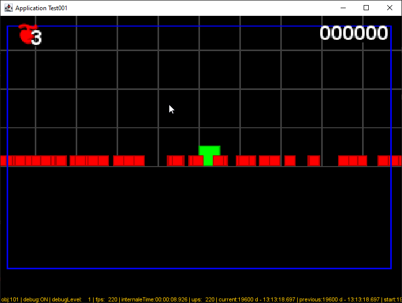

# README

This is a Simple java Application for test purposes.

## Contribute

Open this project

- with [Visual Studio Code](https://code.visualstudio.com/download "Download the Visual Studio Code for your preferred OS platform")
as a java project


_figure 1 - Editing your project with Visual Studio Code_

- or into [Jetbrains IntelliJ IDEA](https://www.jetbrains.com/idea/download/ "Download IntelliJ for your own preferred OS Platform").


_figure 2 - Editing your project with Jetbrains IntelliJ IDEA_

## Build

```bash
sdk env install
sdk env use
build.sh a
```

## Execute

Retreive in the properties file the project name and peoject version to adapt the command line bellow:

```properties
project.name=Test001
...
project.version=0.0.1
...
```

Execute the simple command line:

```bash
java -jar target/[project.name]-[project.version].jar
```

Or if you are under a Linux machine of a git bash session on Windows:

```bash
. target/build/[project.name]-[project.version].run
```

You will get something like this window :



_figure 3 - Executing the App class_

McG.
