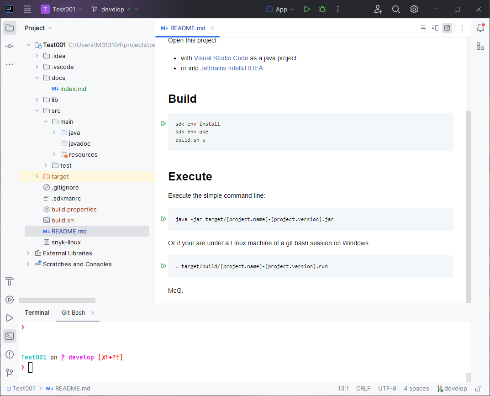

# README

 [](https://github.com/Smcgivrer/SimpleJavaDeskProject/actions/workflows/build.yml)

This is a Simple java Application for test purposes.

## Build

```bash
sdk env install
sdk env use
build.sh a
```

> [!NOTE]
> See [README build script](./build.readme.md) for more details.

## Execute

Retrieve in the properties file the project name and project version to adapt the command line bellow:

```properties
project.name=sjdp
project.title=SJDP
project.version=0.0.1
...
```

Execute the simple command line:

```bash
java -jar target/[project.name]-[project.version].jar
```

Or if you are under a Linux machine of a git bash session on Windows:

```bash
. target/build/[project.name]-[project.version].run
```

You will get something like this window :

<figure>
  
  <figcaption>figure 1 - Executing the App class</figcaption>
</figure>

## Contribute

Open this project

-
with [Visual Studio Code](https://code.visualstudio.com/download "Download the Visual Studio Code for your preferred OS platform")
as a java project

<figure>
  
  <figcaption>figure 2 - Editing your project with Visual Studio Code</figcaption>
</figure>

- or with the
  JetBrain [IntelliJ IDEA](https://www.jetbrains.com/idea/download/ "Download IntelliJ for your own preferred OS Platform").

<figure>
  
  <figcaption>figure 3 - Editing your project with Jetbrains IntelliJ IDEA</figcaption>
</figure>

McG.
